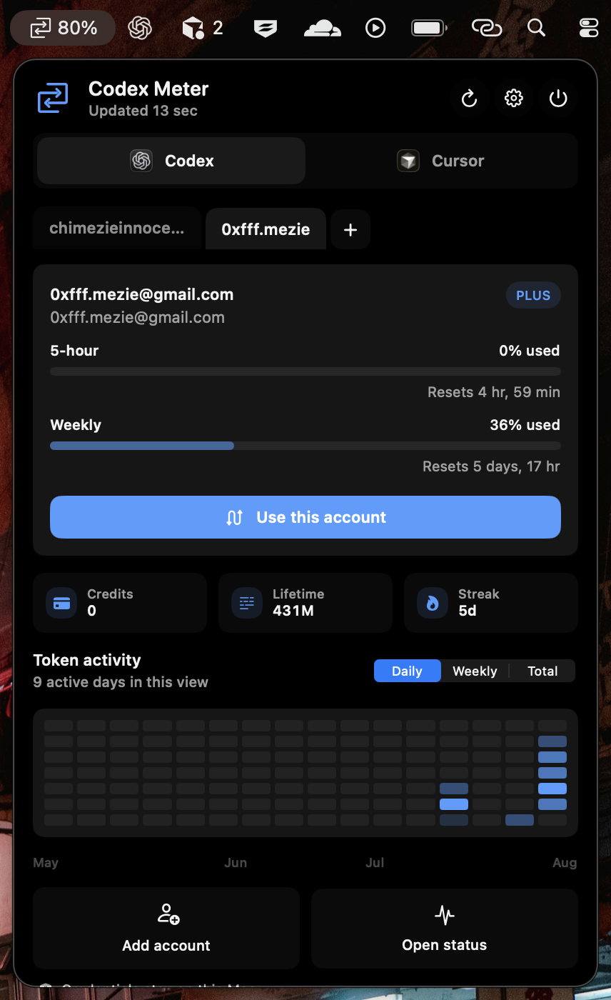

# Codex Meter

Codex Meter keeps Codex and Cursor limits visible without handing credentials to an authentication library.




## Why I built it

I built Codex Meter because checking usage limits and moving between accounts felt more awkward than it needed to be; I had to log out and then sign into the next account and with codex current logout error I get when I log out, it was even more pertinent that I build it for myself.

I wanted one calm, dependable place where I could see the information that matters, switch accounts quickly, and get back to work without digging through dashboards unnecessary sign out and sign in.

Privacy also mattered just as much as I did not want to hand my `auth.json` file to an unfamiliar package or authentication library. There are other libs that do this same thing though but I have llm tokens and it's a simple app so why not. Codex Meter works with the official Codex app server and keeps account credentials on the Mac. The result is a small, focused utility that feels native, stays out of the way, and makes everyday Codex use noticeably smoother.

## What it does

Codex Meter brings the essential details from Codex and Cursor into a polished menu-bar interface (See image above). It is designed to be quick to read, pleasantly compact, and genuinely useful throughout the day.

- Shows the current 5-hour and weekly Codex limits, remaining percentages, and reset times.
- Displays available credits, lifetime token usage, and activity streaks.
- Keeps multiple Codex accounts organised and switches the desktop app to the selected account.
- Shows Cursor plan usage, on-demand spending, token totals, and billing-cycle timing.
- Presents token activity in a clear 16-week heatmap with daily, weekly, and cumulative views.
- Refreshes usage automatically and provides a manual refresh whenever you need the latest figures.
- Includes a lightweight, dependency-free CLI for macOS and Linux.
- Keeps credentials local, with no analytics, telemetry, or remote database.

## Install

### macOS menu-bar app

Clone and build the app locally:

```sh
git clone https://github.com/Vic-Orlands/codex-meter.git
cd codex-meter
Scripts/build-app.sh
open "dist/Codex Meter.app"
```

Requirements:

- macOS 14 or newer
- The official Codex CLI installed and signed in
- Cursor installed and signed in for Cursor usage

### Command line on macOS or Linux

The CLI requires Python 3.9+ and the official Codex CLI. It has no Python package dependencies.

```sh
git clone https://github.com/Vic-Orlands/codex-meter.git
cd codex-meter
Scripts/install-cli.sh
```

Ensure `~/.local/bin` is on `PATH`, then run:

```sh
codex-meter
codex-meter --watch 60
codex-meter --json
```

Use `--codex PATH` when Codex is not on `PATH`, or `--codex-home PATH` to inspect another Codex home.

## Privacy model

- No third-party runtime dependencies.
- OAuth, refresh-token handling, account details, rate limits, credits, and Codex usage come from the installed official `codex app-server` process.
- Each macOS app account has an isolated `CODEX_HOME` under `~/Library/Application Support/CodexMeter/Accounts`.
- Codex Meter never decodes or logs `auth.json`. Account switching uses an atomic local copy and enforces `0600` permissions.
- No analytics, telemetry, or remote database.

Cursor support opens Cursor's VS Code-style state database read-only and uses its existing short-lived access token only in memory with an ephemeral URL session. The token is never refreshed, printed, copied, or persisted. Cursor usage comes from Cursor's signed-in dashboard endpoints, which are not a documented public API and may need maintenance if Cursor changes them.

## Build locally

```sh
git clone https://github.com/Vic-Orlands/codex-meter.git
cd codex-meter
swift test
Scripts/build-app.sh
open "dist/Codex Meter.app"
```

Run the CLI tests with:

```sh
python3 -m unittest Tests/cli_test.py
```

## Platform scope

The tray interface uses SwiftUI and AppKit and is therefore macOS-only. The CLI runs on macOS and Linux and uses the same official app-server boundary without reading credentials. Cursor tracking is currently available only in the macOS app because it depends on Cursor's macOS local state.

## License

MIT
